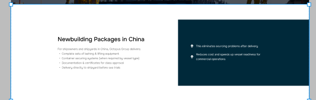
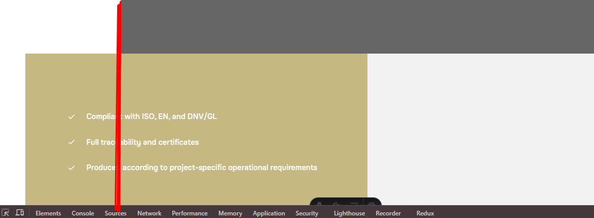
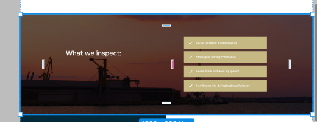

страница lifting блок совсем не по дизайну 
хотя блок есть на фронтенде
{
  "version": "1.0.0",
  "source": {
    "fileName": "octopus group (Copy)",
    "selection": [
      "79:2116"
    ],
    "extractedAt": "2026-05-24T18:01:13.174Z"
  },
  "tokens": {
    "colors": {
      "color-1": "#FFFFFF",
      "color-2": "#040404",
      "color-3": "#757575",
      "color-4": "#00293A"
    },
    "typography": {
      "h1-medium": {
        "fontWeight": 500,
        "fontSize": 38,
        "lineHeight": 50.0099983215332,
        "letterSpacing": 0
      },
      "body-lg-regular": {
        "fontWeight": 400,
        "fontSize": 18,
        "lineHeight": 30.010000228881836,
        "letterSpacing": 0
      }
    },
    "spacing": {
      "spacing-60": 60,
      "spacing-xl": 24,
      "spacing-lg": 16
    },
    "radius": {},
    "shadows": {}
  },
  "components": [],
  "root": {
    "id": "79:2116",
    "kind": "screen",
    "name": "82",
    "width": 1920,
    "height": 625,
    "position": "relational",
    "layout": {
      "direction": "vertical",
      "gap": "spacing-60",
      "padding": {
        "top": 200,
        "right": 300,
        "bottom": 200,
        "left": 300
      }
    },
    "style": {
      "background": "color-1"
    },
    "children": [
      {
        "id": "79:2123",
        "kind": "container",
        "name": "78",
        "width": 638,
        "height": 225,
        "position": "relational",
        "layout": {
          "direction": "vertical",
          "gap": "spacing-xl"
        },
        "responsive": {
          "height": "hug"
        },
        "children": [
          {
            "id": "79:2124",
            "kind": "text",
            "name": "Heading 2 → About the service",
            "width": 638,
            "height": 50,
            "position": "relational",
            "text": {
              "content": "Newbuilding Packages in China",
              "typography": "h1-medium",
              "color": "color-2",
              "textAlign": "left"
            },
            "semanticRole": "semantic",
            "signals": {
              "nonInteractive": true
            },
            "context": {
              "zIndex": -1,
              "hierarchyDepth": 2
            }
          },
          {
            "id": "79:2125",
            "kind": "text",
            "name": "For shipowners and shipyards in China, Octopus Group delivers: Complete sets of lashing & lifting equipment Container securing systems (when required by vessel type) Documentation & certificates for class approval Delivery directly to shipyard before sea trials",
            "width": 638,
            "height": 151,
            "position": "relational",
            "text": {
              "content": "For shipowners and shipyards in China, Octopus Group delivers:\nComplete sets of lashing & lifting equipment\nContainer securing systems (when required by vessel type)\nDocumentation & certificates for class approval\nDelivery directly to shipyard before sea trials",
              "typography": "body-lg-regular",
              "color": "color-3",
              "textAlign": "left"
            },
            "semanticRole": "semantic",
            "signals": {
              "nonInteractive": true
            },
            "context": {
              "zIndex": -1,
              "hierarchyDepth": 2
            }
          }
        ],
        "semanticRole": "structural",
        "signals": {
          "nonInteractive": true
        },
        "context": {
          "zIndex": -1,
          "hierarchyDepth": 1
        }
      },
      {
        "id": "79:2143",
        "kind": "container",
        "name": "84",
        "width": 844,
        "height": 429,
        "position": "absolute",
        "layout": {
          "direction": "vertical",
          "gap": "spacing-xl",
          "padding": {
            "top": 100,
            "right": 300,
            "bottom": 100,
            "left": 80
          },
          "justifyContent": "center"
        },
        "style": {
          "background": "color-4"
        },
        "absolute": {
          "top": 98,
          "left": 1076,
          "right": 0,
          "bottom": 98
        },
        "constraints": {
          "horizontal": "left",
          "vertical": "center"
        },
        "children": [
          {
            "id": "79:2147",
            "kind": "container",
            "name": "87",
            "width": 464,
            "height": 30,
            "position": "relational",
            "layout": {
              "direction": "horizontal",
              "gap": "spacing-lg",
              "alignItems": "center"
            },
            "responsive": {
              "width": "hug"
            },
            "children": [
              {
                "id": "79:2144",
                "kind": "icon",
                "name": "Bulb1",
                "width": 20,
                "height": 20,
                "position": "relational",
                "semanticRole": "semantic",
                "signals": {
                  "nonInteractive": true
                },
                "context": {
                  "zIndex": -1,
                  "hierarchyDepth": 3
                }
              },
              {
                "id": "79:2146",
                "kind": "text",
                "name": "This eliminates sourcing problems after delivery",
                "width": 428,
                "height": 30,
                "position": "relational",
                "text": {
                  "content": "This eliminates sourcing problems after delivery",
                  "typography": "body-lg-regular",
                  "color": "color-1",
                  "textAlign": "left"
                },
                "semanticRole": "semantic",
                "signals": {
                  "nonInteractive": true
                },
                "context": {
                  "zIndex": -1,
                  "hierarchyDepth": 3
                }
              }
            ],
            "semanticRole": "structural",
            "signals": {
              "nonInteractive": true
            },
            "context": {
              "zIndex": -1,
              "hierarchyDepth": 2
            }
          },
          {
            "id": "79:2149",
            "kind": "container",
            "name": "88",
            "width": 464,
            "height": 61,
            "position": "relational",
            "layout": {
              "direction": "horizontal",
              "gap": "spacing-lg",
              "alignItems": "center"
            },
            "responsive": {
              "width": "hug"
            },
            "children": [
              {
                "id": "79:2150",
                "kind": "icon",
                "name": "Bulb1",
                "width": 20,
                "height": 20,
                "position": "relational",
                "semanticRole": "semantic",
                "signals": {
                  "nonInteractive": true
                },
                "context": {
                  "zIndex": -1,
                  "hierarchyDepth": 3
                }
              },
              {
                "id": "79:2152",
                "kind": "text",
                "name": "Reduces cost and speeds up vessel readiness for commercial operations",
                "width": 428,
                "height": 61,
                "position": "relational",
                "text": {
                  "content": "Reduces cost and speeds up vessel readiness for commercial operations",
                  "typography": "body-lg-regular",
                  "color": "color-1",
                  "textAlign": "left"
                },
                "semanticRole": "semantic",
                "signals": {
                  "nonInteractive": true
                },
                "context": {
                  "zIndex": -1,
                  "hierarchyDepth": 3
                }
              }
            ],
            "semanticRole": "structural",
            "signals": {
              "nonInteractive": true
            },
            "context": {
              "zIndex": -1,
              "hierarchyDepth": 2
            }
          }
        ],
        "semanticRole": "structural",
        "signals": {
          "nonInteractive": true,
          "foregroundLayer": true,
          "edgeAttached": true
        },
        "context": {
          "position": "left-edge",
          "zIndex": -1,
          "hierarchyDepth": 1
        },
        "layoutRelationship": {
          "edgeAttached": true
        }
      }
    ],
    "semanticRole": "structural",
    "signals": {
      "nonInteractive": true
    },
    "context": {
      "zIndex": -1
    }
  }
}

страница manufacture-of-steel-structures блок service-detail-production__bottom должен біть выровнян по левому краю картинки сверху  красной линией показал как должно быть

страница port-captain-service
блок где текст We review: совсем взят ни откуда а должен быть блок как в марин с текстом Our Approach
(его джсон) но блок присутвуем в верстке
{
  "version": "1.0.0",
  "source": {
    "fileName": "octopus group (Copy)",
    "selection": [
      "133:559"
    ],
    "extractedAt": "2026-05-24T18:06:35.470Z"
  },
  "tokens": {
    "colors": {
      "color-1": "#FFFFFF",
      "color-2": "#040404",
      "color-3": "#757575",
      "color-4": "#C5B883",
      "color-5": "rgba(255, 255, 255, 0.8)"
    },
    "typography": {
      "h1-medium": {
        "fontWeight": 500,
        "fontSize": 38,
        "lineHeight": 50.0099983215332,
        "letterSpacing": 0
      },
      "body-lg-regular": {
        "fontWeight": 400,
        "fontSize": 18,
        "lineHeight": 30.010000228881836,
        "letterSpacing": 0
      }
    },
    "spacing": {
      "spacing-2xl": 32,
      "spacing-xl": 24,
      "spacing-lg": 16
    },
    "radius": {},
    "shadows": {}
  },
  "components": [],
  "root": {
    "id": "133:559",
    "kind": "screen",
    "name": "127",
    "width": 1920,
    "height": 540,
    "position": "relational",
    "layout": {
      "direction": "horizontal",
      "justifyContent": "center",
      "alignItems": "center"
    },
    "children": [
      {
        "id": "133:560",
        "kind": "container",
        "name": "105",
        "width": 960,
        "height": 540,
        "position": "relational",
        "layout": {
          "direction": "vertical",
          "padding": {
            "top": 100,
            "right": 80,
            "bottom": 100,
            "left": 300
          }
        },
        "style": {
          "background": "color-1"
        },
        "children": [
          {
            "id": "133:561",
            "kind": "container",
            "name": "78",
            "width": 549,
            "height": 135,
            "position": "relational",
            "layout": {
              "direction": "vertical",
              "gap": "spacing-xl"
            },
            "responsive": {
              "height": "hug"
            },
            "children": [
              {
                "id": "133:562",
                "kind": "text",
                "name": "Heading 2 → About the service",
                "width": 549,
                "height": 50,
                "position": "relational",
                "text": {
                  "content": "Our Approach",
                  "typography": "h1-medium",
                  "color": "color-2",
                  "textAlign": "left"
                },
                "semanticRole": "semantic",
                "signals": {
                  "nonInteractive": true
                },
                "context": {
                  "zIndex": -1,
                  "hierarchyDepth": 3
                }
              },
              {
                "id": "133:563",
                "kind": "text",
                "name": "Our focus is to identify risks early and ensure operational efficiency",
                "width": 549,
                "height": 61,
                "position": "relational",
                "text": {
                  "content": "Our focus is to identify risks early and ensure operational efficiency",
                  "typography": "body-lg-regular",
                  "color": "color-3",
                  "textAlign": "left"
                },
                "semanticRole": "semantic",
                "signals": {
                  "nonInteractive": true
                },
                "context": {
                  "zIndex": -1,
                  "hierarchyDepth": 3
                }
              }
            ],
            "semanticRole": "structural",
            "signals": {
              "nonInteractive": true
            },
            "context": {
              "zIndex": -1,
              "hierarchyDepth": 2
            }
          }
        ],
        "semanticRole": "structural",
        "signals": {
          "nonInteractive": true
        },
        "context": {
          "zIndex": -1,
          "hierarchyDepth": 1
        }
      },
      {
        "id": "133:564",
        "kind": "container",
        "name": "84",
        "width": 960,
        "height": 540,
        "position": "relational",
        "layout": {
          "direction": "vertical",
          "gap": "spacing-2xl",
          "padding": {
            "top": 100,
            "right": 300,
            "bottom": 100,
            "left": 80
          },
          "justifyContent": "center"
        },
        "responsive": {
          "width": "hug"
        },
        "style": {
          "background": "color-4"
        },
        "children": [
          {
            "id": "133:565",
            "kind": "text",
            "name": "We review:",
            "width": 580,
            "height": 30,
            "position": "relational",
            "text": {
              "content": "We review:",
              "typography": "body-lg-regular",
              "color": "color-5",
              "textAlign": "left"
            },
            "semanticRole": "semantic",
            "signals": {
              "nonInteractive": true
            },
            "context": {
              "zIndex": -1,
              "hierarchyDepth": 2
            }
          },
          {
            "id": "133:566",
            "kind": "container",
            "name": "99",
            "width": 580,
            "height": 278,
            "position": "relational",
            "layout": {
              "direction": "vertical",
              "gap": "spacing-2xl"
            },
            "responsive": {
              "height": "hug"
            },
            "children": [
              {
                "id": "133:567",
                "kind": "container",
                "name": "87",
                "width": 580,
                "height": 30,
                "position": "relational",
                "layout": {
                  "direction": "horizontal",
                  "gap": "spacing-lg",
                  "alignItems": "center"
                },
                "responsive": {
                  "width": "hug"
                },
                "children": [
                  {
                    "id": "133:568",
                    "kind": "icon",
                    "name": "Bulb1",
                    "width": 20,
                    "height": 20,
                    "position": "relational",
                    "semanticRole": "semantic",
                    "signals": {
                      "nonInteractive": true
                    },
                    "context": {
                      "zIndex": -1,
                      "hierarchyDepth": 4
                    }
                  },
                  {
                    "id": "133:570",
                    "kind": "text",
                    "name": "Cargo information and drawings",
                    "width": 544,
                    "height": 30,
                    "position": "relational",
                    "text": {
                      "content": "Cargo information and drawings",
                      "typography": "body-lg-regular",
                      "color": "color-1",
                      "textAlign": "left"
                    },
                    "semanticRole": "semantic",
                    "signals": {
                      "nonInteractive": true
                    },
                    "context": {
                      "zIndex": -1,
                      "hierarchyDepth": 4
                    }
                  }
                ],
                "semanticRole": "structural",
                "signals": {
                  "nonInteractive": true
                },
                "context": {
                  "zIndex": -1,
                  "hierarchyDepth": 3
                }
              },
              {
                "id": "133:571",
                "kind": "container",
                "name": "89",
                "width": 580,
                "height": 30,
                "position": "relational",
                "layout": {
                  "direction": "horizontal",
                  "gap": "spacing-lg",
                  "alignItems": "center"
                },
                "responsive": {
                  "width": "hug"
                },
                "children": [
                  {
                    "id": "133:572",
                    "kind": "icon",
                    "name": "Bulb1",
                    "width": 20,
                    "height": 20,
                    "position": "relational",
                    "semanticRole": "semantic",
                    "signals": {
                      "nonInteractive": true
                    },
                    "context": {
                      "zIndex": -1,
                      "hierarchyDepth": 4
                    }
                  },
                  {
                    "id": "133:574",
                    "kind": "text",
                    "name": "Vessel and lifting equipment compatibility",
                    "width": 544,
                    "height": 30,
                    "position": "relational",
                    "text": {
                      "content": "Vessel and lifting equipment compatibility",
                      "typography": "body-lg-regular",
                      "color": "color-1",
                      "textAlign": "left"
                    },
                    "semanticRole": "semantic",
                    "signals": {
                      "nonInteractive": true
                    },
                    "context": {
                      "zIndex": -1,
                      "hierarchyDepth": 4
                    }
                  }
                ],
                "semanticRole": "structural",
                "signals": {
                  "nonInteractive": true
                },
                "context": {
                  "zIndex": -1,
                  "hierarchyDepth": 3
                }
              },
              {
                "id": "133:575",
                "kind": "container",
                "name": "90",
                "width": 580,
                "height": 30,
                "position": "relational",
                "layout": {
                  "direction": "horizontal",
                  "gap": "spacing-lg",
                  "alignItems": "center"
                },
                "responsive": {
                  "width": "hug"
                },
                "children": [
                  {
                    "id": "133:576",
                    "kind": "icon",
                    "name": "Bulb1",
                    "width": 20,
                    "height": 20,
                    "position": "relational",
                    "semanticRole": "semantic",
                    "signals": {
                      "nonInteractive": true
                    },
                    "context": {
                      "zIndex": -1,
                      "hierarchyDepth": 4
                    }
                  },
                  {
                    "id": "133:578",
                    "kind": "text",
                    "name": "Terminal capabilities and local restrictions",
                    "width": 544,
                    "height": 30,
                    "position": "relational",
                    "text": {
                      "content": "Terminal capabilities and local restrictions",
                      "typography": "body-lg-regular",
                      "color": "color-1",
                      "textAlign": "left"
                    },
                    "semanticRole": "semantic",
                    "signals": {
                      "nonInteractive": true
                    },
                    "context": {
                      "zIndex": -1,
                      "hierarchyDepth": 4
                    }
                  }
                ],
                "semanticRole": "structural",
                "signals": {
                  "nonInteractive": true
                },
                "context": {
                  "zIndex": -1,
                  "hierarchyDepth": 3
                }
              },
              {
                "id": "133:579",
                "kind": "container",
                "name": "91",
                "width": 580,
                "height": 30,
                "position": "relational",
                "layout": {
                  "direction": "horizontal",
                  "gap": "spacing-lg",
                  "alignItems": "center"
                },
                "responsive": {
                  "width": "hug"
                },
                "children": [
                  {
                    "id": "133:580",
                    "kind": "icon",
                    "name": "Bulb1",
                    "width": 20,
                    "height": 20,
                    "position": "relational",
                    "semanticRole": "semantic",
                    "signals": {
                      "nonInteractive": true
                    },
                    "context": {
                      "zIndex": -1,
                      "hierarchyDepth": 4
                    }
                  },
                  {
                    "id": "133:582",
                    "kind": "text",
                    "name": "Environmental and navigational factors",
                    "width": 544,
                    "height": 30,
                    "position": "relational",
                    "text": {
                      "content": "Environmental and navigational factors",
                      "typography": "body-lg-regular",
                      "color": "color-1",
                      "textAlign": "left"
                    },
                    "semanticRole": "semantic",
                    "signals": {
                      "nonInteractive": true
                    },
                    "context": {
                      "zIndex": -1,
                      "hierarchyDepth": 4
                    }
                  }
                ],
                "semanticRole": "structural",
                "signals": {
                  "nonInteractive": true
                },
                "context": {
                  "zIndex": -1,
                  "hierarchyDepth": 3
                }
              },
              {
                "id": "133:583",
                "kind": "container",
                "name": "88",
                "width": 580,
                "height": 30,
                "position": "relational",
                "layout": {
                  "direction": "horizontal",
                  "gap": "spacing-lg",
                  "alignItems": "center"
                },
                "responsive": {
                  "width": "hug"
                },
                "children": [
                  {
                    "id": "133:584",
                    "kind": "icon",
                    "name": "Bulb1",
                    "width": 20,
                    "height": 20,
                    "position": "relational",
                    "semanticRole": "semantic",
                    "signals": {
                      "nonInteractive": true
                    },
                    "context": {
                      "zIndex": -1,
                      "hierarchyDepth": 4
                    }
                  },
                  {
                    "id": "133:586",
                    "kind": "text",
                    "name": "Applicable standards: IMO, ISO, DNV, OCIMF",
                    "width": 544,
                    "height": 30,
                    "position": "relational",
                    "text": {
                      "content": "Applicable standards: IMO, ISO, DNV, OCIMF",
                      "typography": "body-lg-regular",
                      "color": "color-1",
                      "textAlign": "left"
                    },
                    "semanticRole": "semantic",
                    "signals": {
                      "nonInteractive": true
                    },
                    "context": {
                      "zIndex": -1,
                      "hierarchyDepth": 4
                    }
                  }
                ],
                "semanticRole": "structural",
                "signals": {
                  "nonInteractive": true
                },
                "context": {
                  "zIndex": -1,
                  "hierarchyDepth": 3
                }
              }
            ],
            "semanticRole": "structural",
            "signals": {
              "nonInteractive": true
            },
            "context": {
              "zIndex": -1,
              "hierarchyDepth": 2
            }
          }
        ],
        "semanticRole": "structural",
        "signals": {
          "nonInteractive": true
        },
        "context": {
          "zIndex": -1,
          "hierarchyDepth": 1
        }
      }
    ],
    "semanticRole": "structural",
    "signals": {
      "nonInteractive": true
    },
    "context": {
      "zIndex": -1
    }
  }
}

и тоже самое с блоком Reporting, там используется другой блок как в why octopus group (его джсон на всякий случай)
{
  "version": "1.0.0",
  "source": {
    "fileName": "octopus group (Copy)",
    "selection": [
      "124:434"
    ],
    "extractedAt": "2026-05-24T18:07:51.846Z"
  },
  "tokens": {
    "colors": {
      "color-1": "#F2F2F2",
      "color-2": "#040404",
      "color-3": "#757575",
      "color-4": "#FFFFFF"
    },
    "typography": {
      "h1-medium": {
        "fontWeight": 500,
        "fontSize": 44,
        "lineHeight": 53.9900016784668,
        "letterSpacing": 0
      },
      "body-lg-regular": {
        "fontWeight": 400,
        "fontSize": 18,
        "lineHeight": 30.010000228881836,
        "letterSpacing": 0
      },
      "body-lg-medium": {
        "fontWeight": 500,
        "fontSize": 18,
        "lineHeight": 28,
        "letterSpacing": 0
      }
    },
    "spacing": {
      "spacing-40": 40,
      "spacing-2xl": 32
    },
    "radius": {},
    "shadows": {}
  },
  "components": [],
  "root": {
    "id": "124:434",
    "kind": "screen",
    "name": "84",
    "width": 1920,
    "height": 684,
    "position": "relational",
    "layout": {
      "direction": "vertical",
      "gap": "spacing-40",
      "padding": {
        "top": 150,
        "right": 300,
        "bottom": 150,
        "left": 300
      },
      "alignItems": "center"
    },
    "style": {
      "background": "color-1"
    },
    "children": [
      {
        "id": "124:435",
        "kind": "text",
        "name": "Heading 2 → The story of how our\ncompany was founded.",
        "width": 1320,
        "height": 54,
        "position": "relational",
        "text": {
          "content": "Reporting",
          "typography": "h1-medium",
          "color": "color-2",
          "textAlign": "center"
        },
        "semanticRole": "semantic",
        "signals": {
          "nonInteractive": true
        },
        "context": {
          "zIndex": -1,
          "hierarchyDepth": 1
        }
      },
      {
        "id": "134:587",
        "kind": "text",
        "name": "Upon completion:",
        "width": 1320,
        "height": 30,
        "position": "relational",
        "text": {
          "content": "Upon completion:",
          "typography": "body-lg-regular",
          "color": "color-3",
          "textAlign": "center"
        },
        "semanticRole": "semantic",
        "signals": {
          "nonInteractive": true
        },
        "context": {
          "zIndex": -1,
          "hierarchyDepth": 1
        }
      },
      {
        "id": "124:437",
        "kind": "container",
        "name": "29",
        "width": 1320,
        "height": 220,
        "position": "relational",
        "layout": {
          "direction": "horizontal",
          "gap": "spacing-2xl",
          "alignItems": "center"
        },
        "responsive": {
          "width": "hug"
        },
        "children": [
          {
            "id": "124:438",
            "kind": "container",
            "name": "Background+border",
            "width": 418.67,
            "height": 220,
            "position": "relational",
            "layout": {
              "direction": "vertical",
              "gap": "spacing-2xl",
              "padding": {
                "top": 60,
                "right": 40,
                "bottom": 40,
                "left": 40
              }
            },
            "style": {
              "background": "color-4",
              "borderColor": "color-4",
              "borderWidth": 1
            },
            "children": [
              {
                "id": "124:439",
                "kind": "icon",
                "name": "QualityCargoXWebflowTemplate",
                "width": 32,
                "height": 32,
                "position": "relational",
                "semanticRole": "semantic",
                "signals": {
                  "nonInteractive": true
                },
                "context": {
                  "zIndex": -1,
                  "hierarchyDepth": 3
                }
              },
              {
                "id": "124:444",
                "kind": "text",
                "name": "Heading 3 → Quality",
                "width": 338.67,
                "height": 28,
                "position": "relational",
                "text": {
                  "content": "Full operational report",
                  "typography": "body-lg-medium",
                  "color": "color-2",
                  "textAlign": "left"
                },
                "semanticRole": "semantic",
                "signals": {
                  "nonInteractive": true
                },
                "context": {
                  "zIndex": -1,
                  "hierarchyDepth": 3
                }
              }
            ],
            "semanticRole": "structural",
            "signals": {
              "nonInteractive": true
            },
            "context": {
              "zIndex": -1,
              "hierarchyDepth": 2
            }
          },
          {
            "id": "124:445",
            "kind": "container",
            "name": "Background+border",
            "width": 418.67,
            "height": 220,
            "position": "relational",
            "layout": {
              "direction": "vertical",
              "gap": "spacing-2xl",
              "padding": {
                "top": 60,
                "right": 40,
                "bottom": 40,
                "left": 40
              }
            },
            "style": {
              "background": "color-4",
              "borderColor": "color-4",
              "borderWidth": 1
            },
            "children": [
              {
                "id": "124:446",
                "kind": "icon",
                "name": "QualityCargoXWebflowTemplate",
                "width": 32,
                "height": 32,
                "position": "relational",
                "semanticRole": "semantic",
                "signals": {
                  "nonInteractive": true
                },
                "context": {
                  "zIndex": -1,
                  "hierarchyDepth": 3
                }
              },
              {
                "id": "124:451",
                "kind": "text",
                "name": "Heading 3 → Quality",
                "width": 338.67,
                "height": 28,
                "position": "relational",
                "text": {
                  "content": "Photo documentation",
                  "typography": "body-lg-medium",
                  "color": "color-2",
                  "textAlign": "left"
                },
                "semanticRole": "semantic",
                "signals": {
                  "nonInteractive": true
                },
                "context": {
                  "zIndex": -1,
                  "hierarchyDepth": 3
                }
              }
            ],
            "semanticRole": "structural",
            "signals": {
              "nonInteractive": true
            },
            "context": {
              "zIndex": -1,
              "hierarchyDepth": 2
            }
          },
          {
            "id": "124:452",
            "kind": "container",
            "name": "Background+border",
            "width": 418.67,
            "height": 220,
            "position": "relational",
            "layout": {
              "direction": "vertical",
              "gap": "spacing-2xl",
              "padding": {
                "top": 60,
                "right": 40,
                "bottom": 40,
                "left": 40
              }
            },
            "style": {
              "background": "color-4",
              "borderColor": "color-4",
              "borderWidth": 1
            },
            "children": [
              {
                "id": "124:453",
                "kind": "icon",
                "name": "QualityCargoXWebflowTemplate",
                "width": 32,
                "height": 32,
                "position": "relational",
                "semanticRole": "semantic",
                "signals": {
                  "nonInteractive": true
                },
                "context": {
                  "zIndex": -1,
                  "hierarchyDepth": 3
                }
              },
              {
                "id": "124:458",
                "kind": "text",
                "name": "Heading 3 → Quality",
                "width": 338.67,
                "height": 56,
                "position": "relational",
                "text": {
                  "content": "Technical comments and recommendations",
                  "typography": "body-lg-medium",
                  "color": "color-2",
                  "textAlign": "left"
                },
                "semanticRole": "semantic",
                "signals": {
                  "nonInteractive": true
                },
                "context": {
                  "zIndex": -1,
                  "hierarchyDepth": 3
                }
              }
            ],
            "semanticRole": "structural",
            "signals": {
              "nonInteractive": true
            },
            "context": {
              "zIndex": -1,
              "hierarchyDepth": 2
            }
          }
        ],
        "semanticRole": "structural",
        "signals": {
          "nonInteractive": true
        },
        "context": {
          "zIndex": -1,
          "hierarchyDepth": 1
        }
      }
    ],
    "semanticRole": "structural",
    "signals": {
      "nonInteractive": true
    },
    "context": {
      "zIndex": -1
    }
  }
}

страница survey-services
первого блока (после херо) не должно быть а должен быть блок про который я забыл 
потому сверстай его {
  "version": "1.0.0",
  "source": {
    "fileName": "octopus group (Copy)",
    "selection": [
      "134:653"
    ],
    "extractedAt": "2026-05-24T18:09:26.562Z"
  },
  "tokens": {
    "colors": {
      "color-1": "#FFFFFF",
      "color-2": "#757575",
      "color-3": "#C7153B"
    },
    "typography": {
      "body-lg-regular": {
        "fontWeight": 400,
        "fontSize": 18,
        "lineHeight": 30.010000228881836,
        "letterSpacing": 0
      },
      "body-lg-medium": {
        "fontWeight": 500,
        "fontSize": 18,
        "lineHeight": 30.010000228881836,
        "letterSpacing": 0
      }
    },
    "spacing": {
      "spacing-40": 40
    },
    "radius": {},
    "shadows": {}
  },
  "components": [],
  "root": {
    "id": "134:653",
    "kind": "screen",
    "name": "6",
    "width": 1920,
    "height": 498,
    "position": "relational",
    "layout": {
      "direction": "vertical",
      "gap": "spacing-40",
      "padding": {
        "top": 200,
        "right": 300,
        "bottom": 150,
        "left": 300
      },
      "alignItems": "end"
    },
    "style": {
      "background": "color-1"
    },
    "children": [
      {
        "id": "134:656",
        "kind": "text",
        "name": "Octopus Group provides cargo, vessel, and equipment surveys to ensure compliance, safety, and operational efficiency during transport.",
        "width": 1320,
        "height": 30,
        "position": "relational",
        "text": {
          "content": "Octopus Group provides cargo, vessel, and equipment surveys to ensure compliance, safety, and operational efficiency during transport.",
          "typography": "body-lg-regular",
          "color": "color-2",
          "textAlign": "left"
        },
        "semanticRole": "semantic",
        "signals": {
          "nonInteractive": true
        },
        "context": {
          "zIndex": -1,
          "hierarchyDepth": 1
        }
      },
      {
        "id": "135:800",
        "kind": "container",
        "name": "128",
        "width": 442,
        "height": 78,
        "position": "relational",
        "layout": {
          "direction": "horizontal",
          "padding": {
            "top": 24,
            "right": 24,
            "bottom": 24,
            "left": 32
          },
          "alignItems": "center"
        },
        "responsive": {
          "width": "hug",
          "height": "hug"
        },
        "style": {
          "background": "color-3"
        },
        "children": [
          {
            "id": "135:799",
            "kind": "text",
            "name": "We follow global standards: IMO, ISO, OCIMF.",
            "width": 386,
            "height": 30,
            "position": "relational",
            "text": {
              "content": "We follow global standards: IMO, ISO, OCIMF.",
              "typography": "body-lg-medium",
              "color": "color-1",
              "textAlign": "left"
            },
            "semanticRole": "semantic",
            "signals": {
              "nonInteractive": true
            },
            "context": {
              "zIndex": -1,
              "hierarchyDepth": 2
            }
          }
        ],
        "semanticRole": "structural",
        "signals": {
          "nonInteractive": true
        },
        "context": {
          "zIndex": -1,
          "hierarchyDepth": 1
        }
      }
    ],
    "semanticRole": "structural",
    "signals": {
      "nonInteractive": true
    },
    "context": {
      "zIndex": -1
    }
  }
}

след блок тоже не по дизайну 
{
  "version": "1.0.0",
  "source": {
    "fileName": "octopus group (Copy)",
    "selection": [
      "134:653"
    ],
    "extractedAt": "2026-05-24T18:09:26.562Z"
  },
  "tokens": {
    "colors": {
      "color-1": "#FFFFFF",
      "color-2": "#757575",
      "color-3": "#C7153B"
    },
    "typography": {
      "body-lg-regular": {
        "fontWeight": 400,
        "fontSize": 18,
        "lineHeight": 30.010000228881836,
        "letterSpacing": 0
      },
      "body-lg-medium": {
        "fontWeight": 500,
        "fontSize": 18,
        "lineHeight": 30.010000228881836,
        "letterSpacing": 0
      }
    },
    "spacing": {
      "spacing-40": 40
    },
    "radius": {},
    "shadows": {}
  },
  "components": [],
  "root": {
    "id": "134:653",
    "kind": "screen",
    "name": "6",
    "width": 1920,
    "height": 498,
    "position": "relational",
    "layout": {
      "direction": "vertical",
      "gap": "spacing-40",
      "padding": {
        "top": 200,
        "right": 300,
        "bottom": 150,
        "left": 300
      },
      "alignItems": "end"
    },
    "style": {
      "background": "color-1"
    },
    "children": [
      {
        "id": "134:656",
        "kind": "text",
        "name": "Octopus Group provides cargo, vessel, and equipment surveys to ensure compliance, safety, and operational efficiency during transport.",
        "width": 1320,
        "height": 30,
        "position": "relational",
        "text": {
          "content": "Octopus Group provides cargo, vessel, and equipment surveys to ensure compliance, safety, and operational efficiency during transport.",
          "typography": "body-lg-regular",
          "color": "color-2",
          "textAlign": "left"
        },
        "semanticRole": "semantic",
        "signals": {
          "nonInteractive": true
        },
        "context": {
          "zIndex": -1,
          "hierarchyDepth": 1
        }
      },
      {
        "id": "135:800",
        "kind": "container",
        "name": "128",
        "width": 442,
        "height": 78,
        "position": "relational",
        "layout": {
          "direction": "horizontal",
          "padding": {
            "top": 24,
            "right": 24,
            "bottom": 24,
            "left": 32
          },
          "alignItems": "center"
        },
        "responsive": {
          "width": "hug",
          "height": "hug"
        },
        "style": {
          "background": "color-3"
        },
        "children": [
          {
            "id": "135:799",
            "kind": "text",
            "name": "We follow global standards: IMO, ISO, OCIMF.",
            "width": 386,
            "height": 30,
            "position": "relational",
            "text": {
              "content": "We follow global standards: IMO, ISO, OCIMF.",
              "typography": "body-lg-medium",
              "color": "color-1",
              "textAlign": "left"
            },
            "semanticRole": "semantic",
            "signals": {
              "nonInteractive": true
            },
            "context": {
              "zIndex": -1,
              "hierarchyDepth": 2
            }
          }
        ],
        "semanticRole": "structural",
        "signals": {
          "nonInteractive": true
        },
        "context": {
          "zIndex": -1,
          "hierarchyDepth": 1
        }
      }
    ],
    "semanticRole": "structural",
    "signals": {
      "nonInteractive": true
    },
    "context": {
      "zIndex": -1
    }
  }
}
